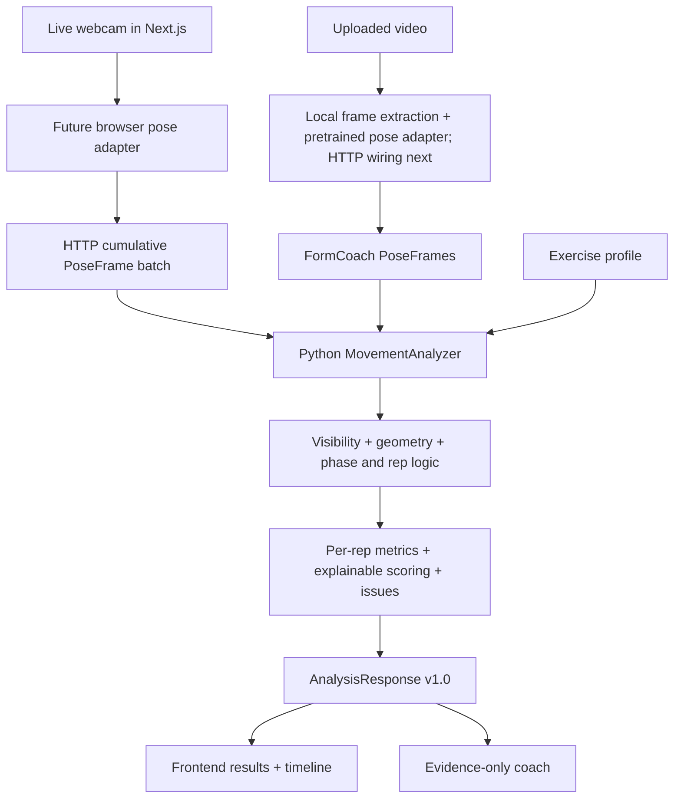

# Architecture

FormCoach converts pose measurements into explainable movement feedback. There are two
input paths and one movement analyzer:

Contracts, interfaces, profiles, geometry, visibility checks, and push-up/squat rep counting through
the live route are implemented. Local backend video pose extraction is available through an optional MediaPipe adapter.
Browser extraction, HTTP upload integration, form scoring, and issues remain future work. Upload returns 501 and coaching uses a local fallback.

## Application boundaries

The frontend runs on port **3000** and the API on **8000**. A port is the numbered local
door an application listens at. `localhost` means the computer running your browser.
Each developer can run their own copy. The frontend can also work entirely from the mock JSON.
CORS permits browser calls from `localhost:3000` and `127.0.0.1:3000` by default.

| Component | Owns | Must not own |
| --- | --- | --- |
| Next.js | Camera permission, eventual browser pose adapter, rendering, playback, user choices | Python scoring/rep algorithms, API credentials |
| Route handlers | HTTP input validation and response/error shapes | Movement math |
| Domain models | Provider-independent poses and versioned analysis | MediaPipe classes, UI components |
| Movement analyzer | Visibility gating, geometry, segmentation, metrics, issue evidence | Video decoding, HTTP, natural-language inventions |
| Exercise profiles | Rules, joints, phases, camera requirements, heuristic weights | Networking |
| Pose/video adapters | Decode/normalize inputs into poses | Independent duplicate movement analyzers |
| Coach service | Explain supplied analysis with confidence/limitations | New biomechanical detections |

## Deliberately small runtime

One browser application, one Python process. No persistence, authentication, queue, Redis,
Docker, or cloud service. The live protocol is stateless: each request contains the sampled
frames from the beginning of the current short set, and its response replaces the current
analysis. An identical request yields identical analysis results. No hidden session cache
or cross-worker state is needed. See the limits and finalization rules in API_CONTRACT.md.

Uploads will initially be synchronous for short clips. If actual processing times require a
job API later, that is a coordinated contract change, not an undocumented behavior switch.
The bootstrap multipart handler closes its temporary upload and retains no recording.

## Contract and code seams

`domain/pose.py`, `domain/analysis.py`, and `domain/models.py` define Pydantic models.
`scripts/export_contracts.py` exports schemas; the frontend generator produces its wire types.
The schema checks in CI catch accidental drift. Python model validators also check relationships
that plain JSON Schema cannot express, such as rep counts and landmark index/name pairs.

`analysis/interfaces.py` defines `MovementAnalyzer`. The live route injects `RuleBasedAnalyzer`
from `analysis/movement.py`, supporting push-ups and squats. Local video processing calls that
same interface after `PoseProvider.extract` returns a `PoseSequence`; HTTP upload wiring is next. Profiles are selected through
`analysis/exercises/registry.py`. Keep algorithm selection behind the interface.

The frontend client lives in `apps/web/src/lib/api/client.ts`; fixture access lives in `mock.ts`.
Both use the same generated `AnalysisResponse`. Components can receive that type as a prop,
so replacing a mock loader with a real request does not require a dashboard rewrite.

## Practical limits

Image-space measurements depend on view, proportions, occlusion, and model confidence.
One 2D camera may not support simultaneous sagittal depth and frontal knee-tracking claims.
Profiles and UI must expose unavailable metrics. The initial live demo chooses a camera
orientation and analyzes only what that view supports.
